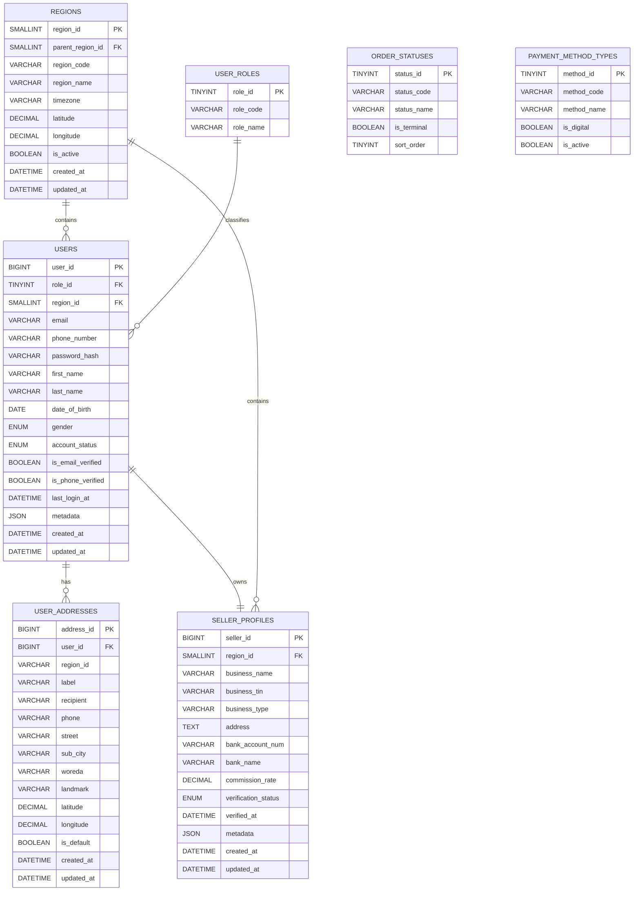
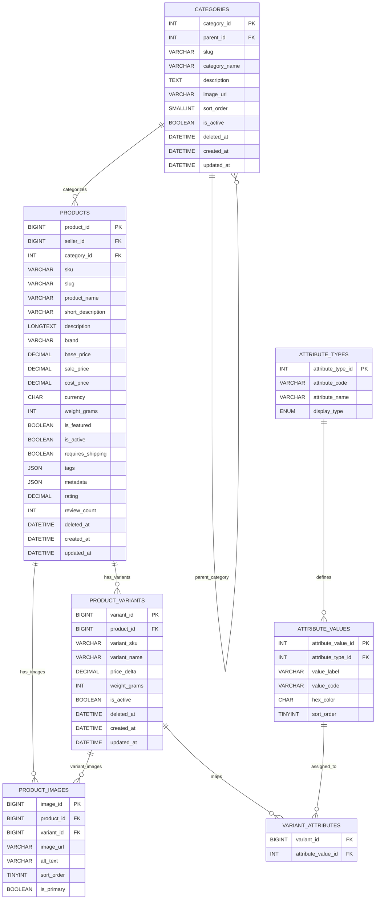
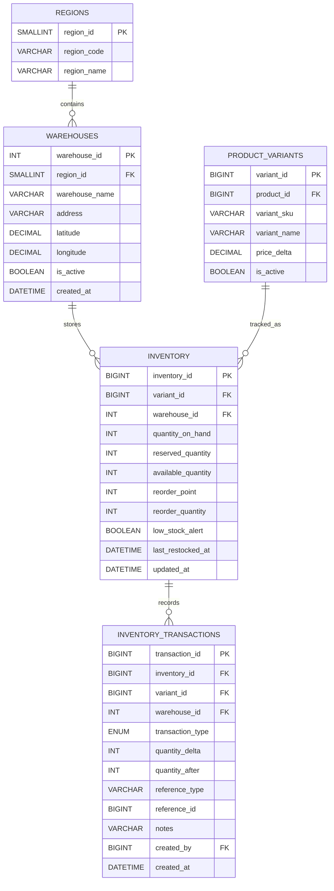
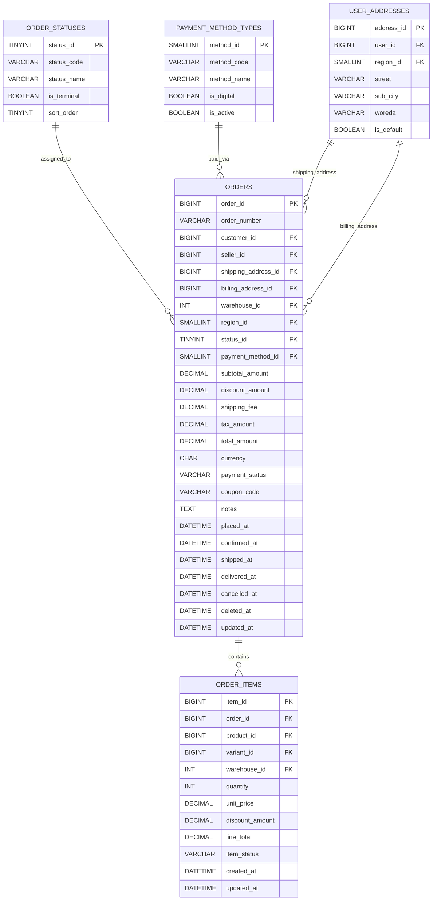
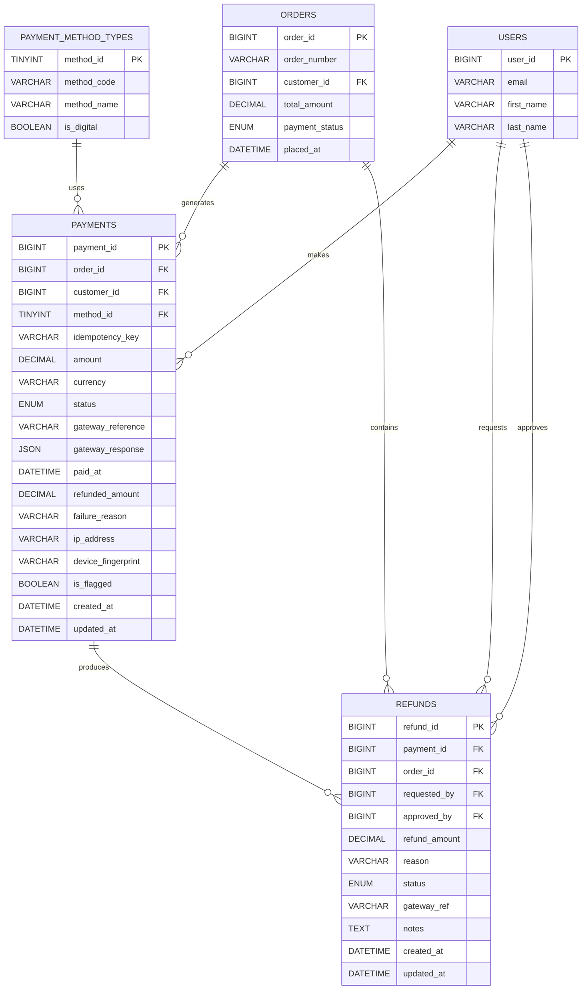
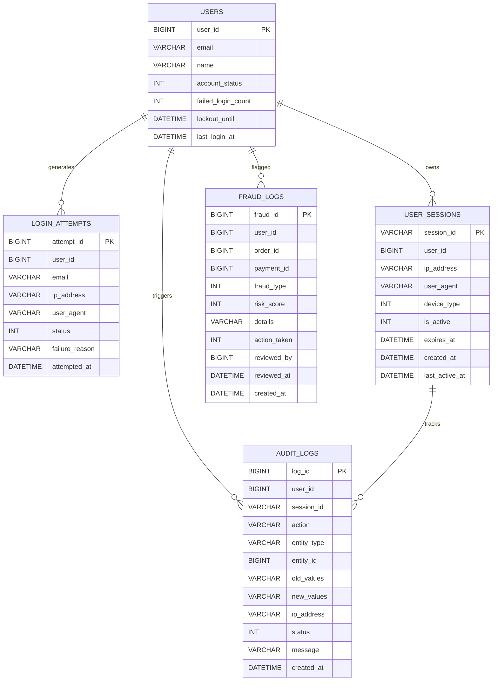

# Ethiopian E-Commerce Platform
## ADVANCED DATABASE SYSTEMS-GROUP 2 PROJECT

### Entity-Relationship Diagram & Relational Schema

---

## Project Overview

This project presents the database architecture and relational schema design for a scalable Ethiopian E-Commerce Platform.

The system is designed using:

- **3NF / BCNF normalization**
- Modular database subsystems
- Enterprise-level relational modeling
- Security and auditing structures
- Analytics and inventory tracking

---

## Project Statistics

| Category | Details |
|---|---|
| Total Tables | 32 |
| Functional Domains | 9 |
| Diagram Pages | 8 |
| Normalization | 3NF / BCNF |

---

## Supported Ethiopian Cities

- Addis Ababa
- Adama
- Hawassa
- Dire Dawa
- Mekelle
- Bahir Dar

---

# Database Subsystems

The platform database is divided into the following domains:

1. User & Identity
2. Product Catalog
3. Inventory
4. Orders
5. Payments
6. Analytics
7. Security & Audit
8. Social & Promo
9. Lookup / Reference

---

# Technology Focus

- Relational DATABASE Design
- PostgreSQL / MySQL Compatible Schema
- High Scalability
- Data Integrity Enforcement
- Optimized Relationships
- Enterprise Normalization Standards

---

# ER Diagram Structure

The following sections contain:

- Entity definitions
- Primary and foreign keys
- Relationship cardinalities
- Normalized schema design
- Domain-based architecture

---
# 1. User & Identity Domain

---

# Domain Description

This domain manages:

- User authentication and identity
- Seller business registration
- Geographic regional hierarchy
- Address management
- Lookup/reference structures
- Order status standardization
- Payment method classification

---

# Design Notes

## User Management
The `USERS` entity acts as the core identity table for customers, admins, and sellers.

## Seller Profiles
The `SELLER_PROFILES` entity extends users with business - specific INFORMATION.

## Regional Structure
The `REGIONS` table supports hierarchical Ethiopian geographic organization.

## Address Handling
Users can store multiple addresses with one default address.

## Lookup Tables
Reference tables improve normalization and enforce consistency across the platform.

---

# Normalization Level

- FULLY NORMALIZED TO **3NF / BCNF**
- Lookup/reference isolation applied
- Redundant data minimized
- Relationship integrity enforced

---
# 2.Product Catalog Subsystem

---
# Domain Description

This domain manages:

- Product catalog organization
- Hierarchical category structures
- Product and SKU management
- Variant-based inventory modeling
- Product image handling
- Dynamic attribute configuration
- Marketplace-ready merchandising structures
- Flexible catalog extensibility

---

# Design Notes

## Product Management
The `PRODUCTS` entity acts as the core catalog table for all sellable items within the platform.

## Category Hierarchy
The `CATEGORIES` entity supports recursive parent-child relationships for scalable multi-level catalog organization.

## Product Variants
The `PRODUCT_VARIANTS` entity extends products into configurable sellable variations such as size, color, and storage options.

## Attribute System
The combination of `ATTRIBUTE_TYPES`, `ATTRIBUTE_VALUES`, and `VARIANT_ATTRIBUTES` enables dynamic product configuration without schema modification.

## Product Images
The `PRODUCT_IMAGES` entity centralizes media management for both product-level and variant-level image assets.

## Junction Table Architecture
The `VARIANT_ATTRIBUTES` table resolves many-to-many relationships between variants and attribute values using normalized relational mapping.

---

# Normalization Level

- Fully normalized to **3NF / BCNF**
- Variant decomposition applied
- Recursive hierarchy normalization implemented
- Attribute lookup isolation enforced
- Many-to-many relationships resolved through junction tables
- Redundant product attribute storage minimized
- Referential integrity enforced
- Enterprise-scale catalog extensibility maintained

---

# 3.Inventory & Warehouse Domain

---

# Domain Description

This domain manages:

- Warehouse management
- Regional inventory distribution
- Product stock tracking
- Multi-warehouse inventory control
- Inventory movement auditing
- Restocking operations
- Stock availability management
- Inventory transaction history

---

# Design Notes

## Warehouse Management
The `WAREHOUSES` entity manages physical storage facilities across different Ethiopian regions.

## Regional Structure
The `REGIONS` entity provides geographic organization for warehouse distribution and logistics management.

## Inventory Tracking
The `INVENTORY` entity tracks stock quantities for each product variant within specific warehouses.

## Product Variant Inventory
The `PRODUCT_VARIANTS` entity enables SKU-level inventory tracking for configurable products.

## Inventory Transactions
The `INVENTORY_TRANSACTIONS` entity records all stock movement activities including:

- Restocking
- Sales deductions
- Returns
- Adjustments
- Transfers

## Stock Control
Inventory quantities support operational stock management through:

- Reserved stock tracking
- Available stock calculations
- Reorder thresholds
- Low stock monitoring

---

# Normalization Level

- Fully normalized to **3NF / BCNF**
- Warehouse-region separation implemented
- Inventory transaction auditing normalized
- SKU-level inventory isolation enforced
- Redundant stock calculations minimized
- Relationship integrity enforced
- Multi-warehouse scalability supported
- Enterprise inventory control architecture maintained
---
# 4.Orders & Checkout Domain

                
---

# Domain Description

This domain manages:

- Customer order processing
- Checkout operations
- Order item management
- Payment method classification
- Order lifecycle tracking
- Shipping and billing addresses
- Regional fulfillment routing
- Multi-seller transaction handling

---

# Design Notes

## Order Management
The `ORDERS` entity acts as the central transactional table for all customer purchases across the platform.

## Order Lifecycle
The `ORDER_STATUSES` entity standardizes order progression stages including:

- Pending
- Confirmed
- Shipped
- Delivered
- Cancelled

## Checkout Processing
The `ORDERS` table manages pricing calculations including:

- Subtotals
- Discounts
- Shipping fees
- Taxes
- Final payable amounts

## Order Items
The `ORDER_ITEMS` entity stores individual purchasable items associated with each order.

This supports:

- Product-level fulfillment
- Warehouse allocation
- SKU-specific pricing
- Item-level status tracking

## Payment Methods
The `PAYMENT_METHOD_TYPES` entity standardizes supported payment channels including digital and traditional payment methods.

## Address Management
The `USER_ADDRESSES` entity supports separate:

- Shipping addresses
- Billing addresses

for flexible checkout workflows.

## Fulfillment Integration
Warehouse and regional references support distributed fulfillment and logistics routing across Ethiopia.

---

# Normalization Level

- Fully normalized to **3NF / BCNF**
- Transactional order decomposition applied
- Payment method lookup normalization enforced
- Order status standardization implemented
- Address reuse normalization supported
- Redundant pricing storage minimized
- Referential integrity enforced
- Enterprise checkout architecture maintained
---

#5.Payments & Refunds Domain

---

# Domain Description

This domain manages:

- Customer payment processing
- Payment method integration
- Refund workflows
- Financial transaction tracking
- Fraud monitoring and auditing

---

# Design Notes

## Payment Management
`PAYMENTS` stores all customer payment transactions and gateway responses.

## Refund Processing
`REFUNDS` manages refund requests, approvals, and refund transaction tracking.

## Payment Methods
`PAYMENT_METHOD_TYPES` standardizes supported payment channels.

## Security & Auditing
Fraud detection fields and audit timestamps support secure transaction monitoring.

---

# Normalization Level

- Fully normalized to **3NF / BCNF**
- Referential integrity enforced
- Lookup table normalization applied
- Scalable transactional architecture maintained
- Financial auditing structure implemented
---
# 6. Security & Audit Domain

