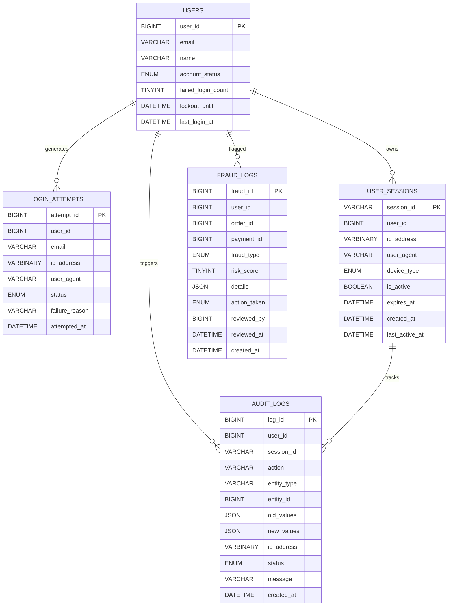
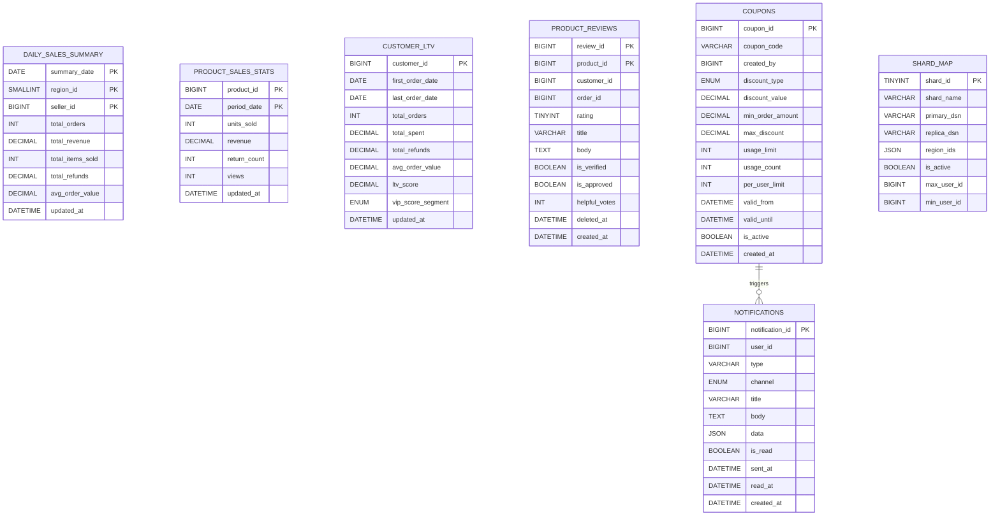

# 6. Security & Audit Domain

---

# Domain Description

This domain manages:

- User authentication and login security  
- Session lifecycle tracking across devices  
- Audit logging for system activity and compliance  
- Fraud detection and risk analysis  
- Security event monitoring and reporting  
- Login attempt tracking and abuse prevention  

---

# Design Notes

## Authentication Security
Tracks user login attempts, failed logins, and account lockouts to prevent brute-force attacks.

## Session Management
Handles active sessions, device tracking, and session expiration for secure access control.

## Audit Logging
Stores immutable logs of user and system actions for compliance, debugging, and traceability.

## Fraud Monitoring
Detects suspicious transactions using risk scoring and stores investigation results.

## Security Monitoring
Combines login activity, session behavior, and audit trails for full security observability.

---

# Normalization Level

- Fully normalized to **3NF / BCNF**
- Login, session, audit, and fraud concerns separated
- No redundant data duplication
- Referential integrity maintained across all relations
- Event-driven security tracking structure
- Scalable audit and monitoring architecture

# 7. Analytics, Promotions & Distributed Architecture Domain

---

# Domain Description

This domain manages:

- Business intelligence and reporting metrics  
- Product performance analytics  
- Customer lifetime value calculations  
- Product reviews and feedback system  
- Promotional coupon management  
- Notification delivery system  
- Distributed database shard configuration  

---

# Design Notes

## Analytics Layer
Aggregated tables like `DAILY_SALES_SUMMARY`, `PRODUCT_SALES_STATS`, and `CUSTOMER_LTV` are used for reporting and BI dashboards.

## Review System
`PRODUCT_REVIEWS` captures customer feedback and supports moderation workflows.

## Promotion Engine
`COUPONS` handles discount rules, usage limits, and campaign configuration.

## Notification System
`NOTIFICATIONS` manages multi-channel user communication (email, SMS, in-app).

## Distributed Architecture
`SHARD_MAP` defines database partitioning strategy across regions and scaling layers.

## Event Flow (Light Coupling)
Coupons can trigger notifications for promotional campaigns.

---

# Normalization Level

- Fully normalized to **3NF / BCNF**
- Analytical tables separated from transactional data
- Event-driven promotion flow (coupons → notifications)
- Review system decoupled from analytics
- Sharding configuration isolated from business logic
- Designed for horizontal scalability
- 
-- =============== -- END OF ER DIAGRAM --==============================================
